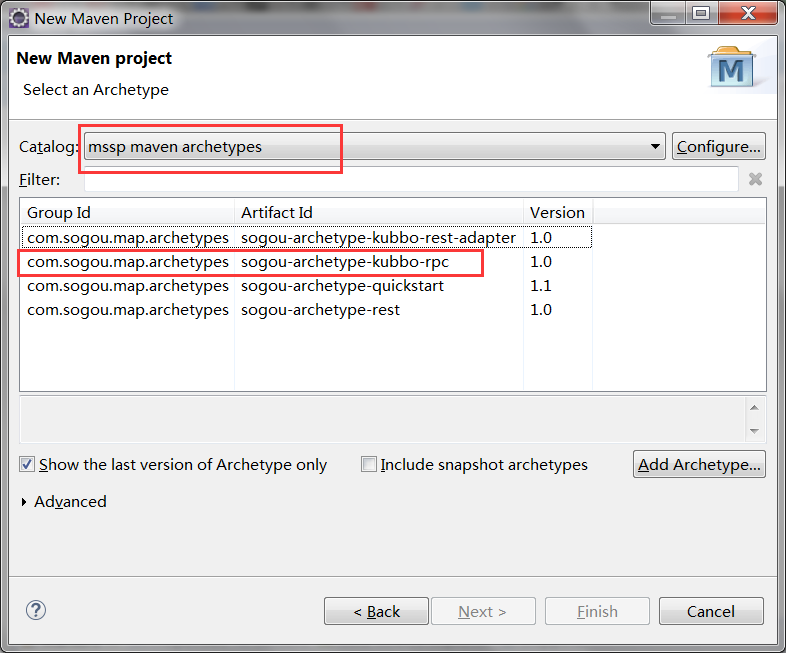

## 使用脚手架创建工程  
以eclipse为例，其他ide类似  
maven配置请参照[maven配置](maven.md)
#### 1. 使用sogou-archetype-kubbo-rpc模板创建工程见下图  
  

#### 2. 项目标识规范  
* groupid 组织名称, 统一使用com.sogou.map  
* artifactid 项目名称，统一使用小写字母, 用"-"分割, 例如route-gateway  
* version 项目版本, 统一使用<大版本号>.<小版本号>.<增量版本号>  
主版本：表示项目结构的重大变更。  
次版本：较大的功能变化。总体构架不变；  
增量版本：修改bug  

#### 3. 工程结构
以sample-service为例  
* sample-service 父工程, 统一管理各子模块  
* sample-service-api api子模块, rpc服务的接口定义和相关的数据接口定义
* sample-service-core core子模块, rpc服务的功能实现  

#### 4. 修改项目版本
需要同时修改
* 父工程版本  
* 子模块中parent的版本  
* 以及core子模块中依赖api子模块的版本

#### 5. 在IDE中启动服务端
在src/test/java中有用于ide中测试用的主类ServerBootstrap, 直接运行即可。

#### 6. 在正式环境中启动服务端
运行mvn package, 生成*sample-service*-api.jar和*sample-service*-core.jar  
将两个jar包放到[kubbo-boot](http://release.mssp.sogou/kubbo/kubbo-boot-latest.tar.gz)的lib目录, 运行bin/run.sh启动服务

