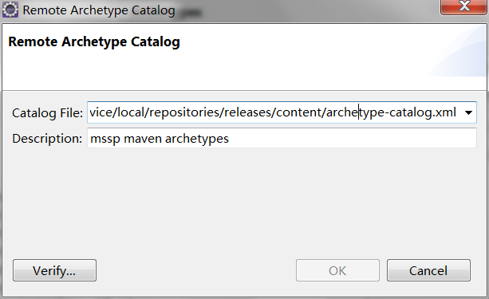

# Maven环境配置
## 一. Maven全局配置
把下面的mirror添加到settings.xml
```
<mirror>
  <id>mssp-maven</id>
  <name>maven repository for mssp platform, sogou map inc.</name>
  <mirrorOf>*</mirrorOf>
  <url>http://repo.mssp.sogou/maven/content/groups/public/</url>
</mirror>
```
通过配置上面的仓库镜像, 便可以获取以下仓库的jar包, 包括  
* [SogouMap仓库](http://repo.mssp.sogou/maven/)
* [SogouCloud仓库](http://cloud.sogou-inc.com/nexus/)
* [Maven中央仓库](http://search.maven.org/)  

如果你希望发布jar包到maven仓库, 请向[管理员](http://git.sogou-inc.com/u/liufuliang)获取认证信息  

## 二. Maven工程模本
你可以将下面的maven archetype catalog地址添加到你的IDE里面, 便可以获取mssp的工程模本
`
http://repo.mssp.sogou/maven/service/local/repositories/releases/content/archetype-catalog.xml
`
以eclipse为例，其他ide类似
设置Window -> Preferences -> Maven -> Archetypes -> Add remote catalog


